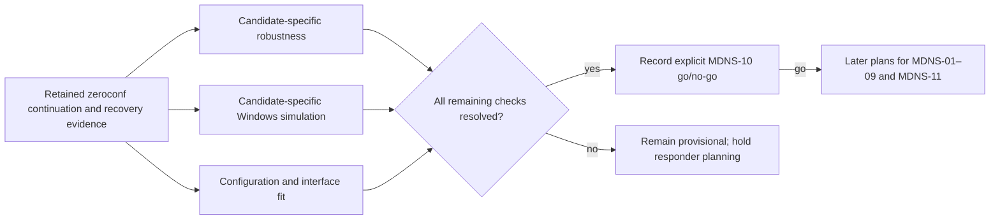

# Phase 3: mDNS Responder - Research

**Researched:** 2026-09-22
**Reconciled:** 2026-09-23 against the completed continuation, recovery prototype and amended D-08
**Domain:** asyncio mDNS responder selection, DNS-SD interoperability and PyApp packaging
**Confidence:** HIGH for the remaining spike-closeout scope; candidate selection remains provisional

<user_constraints>
## User Constraints (from CONTEXT.md)

### Locked Decisions

- **D-01:** Keep device advertisement settings in existing factories and server enablement in `EmulatedLifxServer`, preserving existing calls.
- **D-02:** Server argument: `mdns_enabled=False`. Factory arguments: `mdns_enabled=True` and `mdns_address=None`. Device advertisement settings apply when server mDNS is enabled; `None` uses the spec's concrete bind-address fallback.
- **D-03:** Validate as early as possible. Factories reject invalid addresses, wrong families and Thread opt-out immediately. Server startup checks bind-dependent settings; adding a device checks them before registration.
- **D-04:** Device mDNS settings are fixed at creation, like connectivity. Changing the address or WiFi opt-out requires removing and recreating the device.
- **D-05:** Expose read-only `mdns_status` with `disabled`, `stopped`, `running` and `failed` states, plus `mdns_error`; log failures. No status callback was selected.
- **D-06:** Provide explicit `await server.retry_mdns()` to recover failed mDNS on a functioning WiFi-only server without interrupting LIFX traffic. Automatic retries were not selected.
- **D-07:** When enabled mDNS has failed, reject Thread device additions before changing fleet membership, explaining that mDNS must recover first. Intentionally disabled mDNS remains supported.
- **D-08 (amended 2026-09-23):** Apply the fleet-dependent failure policy to runtime failures surfaced by supported zeroconf operations: WiFi-only continues serving LIFX with failed mDNS status; Thread-only and mixed fleets shut down cleanly and retain the failure details. Do not promise detection of silent listener loss or network unresponsiveness. `running` means lifecycle startup succeeded and no handled failure has been observed, not independently verified network health. No upstream failure callback, fork, vendoring, monkey-patching, private listener inspection or responsiveness watchdog is required for this scope. Retain startup failure handling, observable runtime error handling, owned cleanup and explicit retry. The user accepts the narrower guarantee for this non-production, test-oriented use case and expects users to report encountered limitations.
- **D-09:** Evaluate in order: current `python-zeroconf`; extending or augmenting existing `lifx-async` mDNS; an entirely new responder if neither existing implementation is suitable. Stop investigating a candidate once decisive evidence rules it out.
- **D-10:** Prefer `python-zeroconf` when candidates meet the locked requirements, unless evidence demonstrates a material advantage for an alternative. Use public APIs and a small adapter; dependence on private internals, monkey-patching or a maintained fork favours the fallback candidates.
- **D-11:** For `lifx-async` reuse, compare extending that library directly with adapting relevant code into the emulator. Recommend based on coupling, maintenance and compatibility; neither location is preselected.
- **D-12:** Missing required platform or packaging evidence leaves the choice provisional and holds responder implementation. Record the missing evidence and how to obtain it; confirm go/no-go when required checks run. Do not plan the remaining ten requirements in detail before that decision.
- **D-13:** Benchmark mixed fleets of 1, 10 and 100 devices. Prioritise time for `lifx-async` to discover the complete fleet, recording CPU and memory costs. These are benchmark sizes, not supported fleet limits.
- **D-14:** Share an initial four-hour active-work budget across all candidates; record CI queue time separately. An additional four hours is possible only when initial findings show worthwhile implementation depth, performance or feature completeness within Phase 3 scope. At the limit, record findings and unresolved evidence before proceeding.
- **D-15:** Justify any extension with concrete evidence, documentation links and exact line references. For unnumbered documentation pages, provide version-pinned documentation source links and line numbers. The potential availability of extra time alone does not justify using it.
- **D-16:** Only within a warranted extension, and if time remains after required evidence, test separate-machine feasibility: `lifx-async` on the Mac and `lifx-emulator` in a guest on development Proxmox VE host `devproxmox.lot209.xyz`, on the same multicast-capable network.
- **D-17:** The user reports no usable existing guests. Define and build a small Linux VM with its own kernel/network stack; define resources and network configuration before provisioning. **VM definition, provisioning and cross-machine testing must not occur in the initial four hours.**
- **D-18:** The optional experiment must cover discovery, state queries and light control through advertised endpoints. It is not grounds to extend the spike automatically and does not replace required protocol, coexistence or packaging evidence.

### the agent's Discretion

No explicit discretionary decisions were delegated. Routine internal implementation details remain for research and planning within these decisions; the responder choice remains evidence-gated.

### Deferred Ideas (OUT OF SCOPE)

No additional future-phase capability was adopted. Cross-machine testing remains optional extension-only spike work; full sibling-suite migration stays in Phase 6.
</user_constraints>

## Summary

The implementation-selection work is now in closeout, not initial candidate exploration. Zeroconf 0.151.3 is the preferred provisional foundation after complete-fleet discovery, public-client discovery, membership restoration, direct A/AAAA queries, daemon coexistence, hosted Ubuntu/macOS multicast and Intel PyApp packaging passed in the retained continuation evidence. These results do not constitute the explicit MDNS-10 go decision. [VERIFIED: .planning/phases/03-mdns-responder/03-CONTINUATION.md:33-65]

The recovery prototype also demonstrates public-API partial-start cleanup, explicit retry with a fresh owner, continued WiFi LIFX traffic and Thread/mixed shutdown after an injected surfaced error. It does not prove automatic listener-failure detection. Amended D-08 intentionally excludes silent listener loss and network unresponsiveness, so the negative listener-health diagnostic is a documented limitation rather than a gate requiring an upstream callback, fork, private inspection or watchdog. [VERIFIED: .planning/phases/03-mdns-responder/03-RECOVERY-PROTOTYPE.md:9-30] [VERIFIED: .planning/phases/03-mdns-responder/03-CONTEXT.md:56-68]

**Primary recommendation:** Reuse the existing spike harness for only four remaining closeout checks: zeroconf-specific robustness, zeroconf-specific Windows simulation, candidate configuration/interface fit, and the explicit MDNS-10 go/no-go decision. Preserve older evidence as historical, do not restart fallback comparison, do not spend more exhausted spike budget, and do not authorise responder implementation until that decision is recorded. [VERIFIED: .planning/phases/03-mdns-responder/03-CONTINUATION.md:49-65]

## Architectural Responsibility Map

| Capability | Primary Tier | Secondary Tier | Rationale |
|---|---|---|---|
| Candidate harness and evidence ledger | Test/research tooling | Release CI | Existing scripts and focused tests produce the remaining go/no-go evidence without changing production behaviour. |
| mDNS socket and reply lifecycle | Core backend | OS networking | The core server owns endpoints, tasks, startup and shutdown. [VERIFIED: packages/lifx-emulator-core/src/lifx_emulator/server.py:154-190] |
| Discovery completeness | Sibling client | Core responder | `lifx-async` is the consumer oracle and accumulates records across packets. [VERIFIED: ../lifx-async/src/lifx/network/discovery/mdns/discovery.py:707-844] |
| Intel macOS packaging | Release CI | PyApp/runtime installer | The release workflow has a distinct Intel macOS target and pins its build inputs. [VERIFIED: .github/workflows/release-binaries.yml:7-9] [VERIFIED: .github/workflows/release-binaries.yml:23-83] |
| Optional cross-machine proof | External infrastructure | Client/core | D-16–D-18 reserve this for an evidence-justified extension. |

<phase_requirements>
## Phase Requirements

| ID | Description | Research support |
|---|---|---|
| MDNS-01 | Opt-in IPv4 multicast reception beside the host daemon | Future hard gate: socket reuse, membership and daemon coexistence; detailed implementation deferred. |
| MDNS-02 | Correct legacy-unicast replies | Spike gate from RFC 6762 and raw datagram assertions; implementation deferred. |
| MDNS-03 | Complete discovery independent of packet grouping | Continuation evidence passed exact associations across datagrams for 1/1/10/100 fleets; preserve packet grouping as unconstrained. [VERIFIED: .planning/phases/03-mdns-responder/03-CONTINUATION.md:37-45] |
| MDNS-04 | Exact `id`, `p`, `fw`, `tm` TXT metadata | Future record-content gate; implementation deferred. |
| MDNS-05 | AAAA-only Thread and A-only WiFi | Spike mixed-family compatibility gate; implementation deferred. |
| MDNS-06 | Explicit usable advertised addresses | Future validation gate; implementation deferred. |
| MDNS-07 | Direct A/AAAA follow-up queries | Spike responder-capability gate; implementation deferred. |
| MDNS-08 | Live membership with multiple listeners | Future integration gate; existing manager has single callback slots. [VERIFIED: packages/lifx-emulator-core/src/lifx_emulator/devices/manager.py:140-156] |
| MDNS-09 | Conditional startup failure and owned lifecycle | Recovery evidence supports partial-start cleanup and explicit retry. D-08 handles only errors surfaced by supported zeroconf operations; silent listener loss is outside the guarantee. [VERIFIED: .planning/phases/03-mdns-responder/03-RECOVERY-PROTOTYPE.md:9-30] |
| MDNS-10 | Evidence-led implementation selection | **Plan now:** close the four remaining checks and record an explicit go/no-go; a provisional preference is not a decision. |
| MDNS-11 | Focused datagram, multicast and client tests | Hosted Ubuntu/macOS and focused tests exist; remaining Windows evidence must be candidate-specific simulation rather than inherited direct-responder evidence. [VERIFIED: .planning/phases/03-mdns-responder/03-CONTINUATION.md:37-58] |
</phase_requirements>

## Project Constraints (from AGENTS.md)

- Use Australian English, the latest version when adding dependencies, and address discovered problems or failing tests.
- Preserve unrelated unstaged work. This research owns only this file; the existing planning edits belong to the orchestrator.
- Use `uv` exclusively for Python dependency management and execution; keep imports at the top.
- Commits require `git commit -s` and the configured GPG key. The orchestrator explicitly owns the combined artefact commit, so this researcher must not commit.
- Repository checks use Ruff (line length 88, complexity 10), Pyright standard and function-scoped pytest asyncio loops. [VERIFIED: pyproject.toml:26-75]
- `workflow.nyquist_validation` is `false`, so this research deliberately omits Validation Architecture. [VERIFIED: .planning/config.json:15-31]

## Standard Stack

| Candidate/order | Observed version | Role | Planning direction |
|---|---:|---|---|
| `python-zeroconf` (1) | 0.151.3 in retained evidence | Preferred provisional public asyncio mDNS/DNS-SD foundation | Close the four remaining gates through public APIs and the existing harness; do not restart candidate order unless the final checks decisively reject it. [VERIFIED: .planning/phases/03-mdns-responder/03-CONTINUATION.md:33-60] |
| sibling `lifx-async` (2) | 7.3.0 | Discovery oracle and possible code/library reuse | Compare direct extension with adaptation only after decisive zeroconf evidence. [VERIFIED: ../lifx-async/pyproject.toml:1-20] |
| standard library/new responder (3) | Python 3.10–3.14 | Final fallback | Scope the minimum responder only if both earlier candidates fail. [VERIFIED: .planning/phases/03-mdns-responder/03-SPEC.md:151-163] |
| PyApp release path | project pin 0.26.0 / Python 3.12 | Intel macOS packaging proof | Test the actual pinned workflow; upstream/latest migration is a separate decision. [VERIFIED: .github/workflows/release-binaries.yml:7-9] |

No project dependency installation is part of research. Spike execution should use an isolated `uv` invocation and record the exact resolved candidate version; adding and locking a production dependency happens only after go/no-go.

## Package Legitimacy Audit

| Package | Registry/source evidence | Heuristic verdict | Disposition |
|---|---|---|---|
| `zeroconf` | Official PyPI metadata links the project to `python-zeroconf/python-zeroconf`; current release is 0.151.3. [VERIFIED: https://pypi.org/project/zeroconf/] | `SUS`: the local legitimacy seam reported “too-new”, unknown downloads and no repository; those metadata signals conflict with the opened official metadata and do not establish package unsuitability. | Authorised spike candidate only; no install-selection conclusion. |

Packages removed as `SLOP`: none. The heuristic result is recorded as a limitation and does not create an approval checkpoint; suitability remains governed by the spike's live evidence.

## Architecture Patterns



Use a criterion-by-criterion evidence ledger. Each result must say demonstrated, failed, simulated or untested; include exact versions, elapsed active time, CI queue time, commands, packet captures/assertions and source/document line links. A score cannot override a failed hard gate.

Do not add private listener inspection, monkey-patching, vendoring, a maintained fork, an upstream callback dependency or a responsiveness watchdog to close D-08. Supported-operation errors are the runtime boundary; `running` is lifecycle state, not a fresh network-health assertion. [VERIFIED: .planning/phases/03-mdns-responder/03-CONTEXT.md:56-68]

## MDNS-10 Spike Closeout Contract

The initial four-hour budget and both bounded follow-ups are exhausted. The historical no-harness restriction was explicitly lifted for work that moves the decision forward; this permits focused edits to the existing harness, but does not authorise production integration or a fresh generic candidate spike. [VERIFIED: .planning/phases/03-mdns-responder/03-CONTINUATION.md:3-19] [VERIFIED: .planning/phases/03-mdns-responder/03-CONTINUATION.md:63-65]

| Remaining check | Existing entry point | Required evidence | Completion effect |
|---|---|---|---|
| Zeroconf-specific robustness | `scripts/spike_mdns_candidates.py` existing `candidate-worker --expanded` path, with focused assertions in `scripts/mdns_spike_tests/test_candidates.py` | Malformed/truncated input and bounded-load behaviour for zeroconf itself; do not inherit the old direct responder's `_exercise_adversarial_bounds` result. [VERIFIED: scripts/spike_mdns_candidates.py:880-935] [VERIFIED: scripts/spike_mdns_candidates.py:1210-1282] | Resolve the retained “malformed/flood behaviour” gap. |
| Zeroconf-specific Windows simulation | `scripts/mdns_spike_tests/test_candidates.py`, retaining its explicit simulation labelling and evidence validation | Exercise the candidate/adapter's Windows-facing public configuration seam; do not reuse the direct responder's generic `_socket_option_plan` as zeroconf proof. [VERIFIED: scripts/spike_mdns_candidates.py:500-542] [VERIFIED: scripts/mdns_spike_tests/test_candidates.py:337-360] | Satisfy the simulation-only Windows part of AC-13 without claiming a real Windows run. |
| Configuration/interface fit | `scripts/spike_mdns_candidates.py` existing expanded worker and `scripts/mdns_spike_tests/test_candidates.py` | Prove the candidate can be driven by explicit interfaces and can materialise the locked address/family/empty-fleet rules. Production factory/server integration remains later work. [VERIFIED: scripts/spike_mdns_candidates.py:673-826] [VERIFIED: scripts/mdns_spike_tests/test_candidates.py:504-550] | Resolve the candidate-fit gate without implementing MDNS-01–09. |
| Explicit MDNS-10 decision | Existing evidence validator/renderer commands in `scripts/spike_mdns_candidates.py`; preserve `03-01-EVIDENCE.*` as historical and record the reconciled decision in a current closeout artefact | Criterion-by-criterion pass/fail/untested disposition, exact candidate/version, timebox history, accepted continuation-question exception, amended D-08 boundary and no implementation authorisation by implication. [VERIFIED: scripts/spike_mdns_candidates.py:2924-2955] | Only an explicit go permits detailed responder planning. |

## Don't Hand-Roll

| Problem | Do not build during MDNS-10 | Use instead |
|---|---|---|
| Candidate DNS correctness | Production responder implementation | Raw datagram assertions plus RFC 6762/6763 criteria. |
| Client acceptance | A substitute discovery parser | Sibling `lifx-async` as the end-to-end oracle. |
| Async task ownership | A second task registry | Existing `BackgroundTaskTracker` pattern after go/no-go. [VERIFIED: packages/lifx-emulator-core/src/lifx_emulator/background_tasks.py:13-173] |
| Cross-machine environment | An initial-timebox VM | D-17 extension-only VM after resources/network are defined. |
| Silent listener-health detection | Fork, vendored patch, private listener access, watchdog or upstream callback work | Amended D-08's supported-operation error boundary and honest status semantics. |

## Common Pitfalls

- **Reopening packet-boundary rejection:** aggregation and records spread across packets are permitted. Judge complete, correctly associated fleet discovery instead. [VERIFIED: .planning/phases/03-mdns-responder/03-PACKET-GROUPING-AMENDMENT.md:6-19]
- **Treating `running` as a health probe:** it means startup succeeded and no handled failure was observed; it does not guarantee current socket or network responsiveness. [VERIFIED: .planning/phases/03-mdns-responder/03-CONTEXT.md:56-68]
- **Transferring fallback evidence:** the direct prototype's malformed/flood and Windows results are historical evidence for that prototype, not zeroconf evidence. [VERIFIED: .planning/phases/03-mdns-responder/03-CONTINUATION.md:49-58]
- **Restarting generic exploration:** current work closes named zeroconf gaps. It does not restart fallback comparison, VM work or cross-machine experiments.
- **Planning ahead:** a provisional preference is not the MDNS-10 decision; detailed MDNS-01–09/11 implementation planning remains held.

## Code Example

Public lifecycle shape to probe, not a production adapter:

```python
# Source: python-zeroconf 0.151.3 public asyncio API
azc = AsyncZeroconf(interfaces=[interface], ip_version=IPVersion.V4Only)
await azc.async_register_service(service_info)
await azc.async_unregister_service(service_info)
await azc.async_close()
```

`ServiceInfo` publicly accepts type, name, port, properties, server, TTLs and addresses; the spike still must inspect emitted packets rather than infer wire shape from these inputs. [VERIFIED: https://github.com/python-zeroconf/python-zeroconf/blob/0.151.3/src/zeroconf/_services/info.py#L178-L235]

## Environment Availability

| Dependency | Available observation | Planning consequence |
|---|---|---|
| `uv` | 0.12.7 | Use for isolated spike execution; do not install during planning. |
| Local Python | 3.14.7 on arm64 macOS | Useful local case, but cannot prove Intel macOS. |
| Rust/Cargo | 1.97 | PyApp build tooling is present locally; Intel proof still belongs on the Intel runner. |
| Intel macOS runner | Retained PyApp artefacts contain zeroconf 0.151.3, first-run success and public async API import. [VERIFIED: .planning/phases/03-mdns-responder/03-CONTINUATION.md:45-47] | Gate demonstrated for the provisional candidate. |
| Windows | Candidate-specific simulation remains open. | Do not report a build target or direct-responder socket plan as zeroconf evidence. |
| Proxmox guest | User reports none usable (D-17). | No VM work in the initial four hours. |

## Security Domain

| ASVS category | Applies | Spike control |
|---|---|---|
| V2 Authentication | No | mDNS discovery has no application authentication surface. |
| V3 Session Management | No | No sessions. |
| V4 Access Control | No | No privileged operation is exposed by the spike. |
| V5 Input Validation | Yes | Fuzz/truncate DNS questions, reject malformed names/records safely, and bound packet/record work. |
| V6 Cryptography | No | No cryptographic protocol is introduced. |

Treat malformed datagrams and packet floods as availability threats, multicast replies as possible amplification, and interface/address choice as exposure boundaries. The spike should verify bounded parsing/work, legacy replies only to the query source, explicit interface selection, TTL at most 10 and absence of secrets in TXT. RFC 6762 requires legacy-unicast ID/question echo, clear cache-flush bits and TTL no greater than 10 seconds. [VERIFIED: https://datatracker.ietf.org/doc/html/rfc6762#section-6.7]

## Open Questions for Spike Closeout

1. Does zeroconf itself remain bounded and safe under the required malformed, truncated and load cases?
2. Does the candidate/adapter configuration seam have identified Windows simulation evidence?
3. Does the candidate fit every locked explicit-interface, address-family and empty-fleet rule without production integration?
4. After those checks, is the explicit MDNS-10 decision go or no-go?

These are execution checks, not blockers to planning MDNS-10 and not permission to plan the remaining requirements.

## Assumptions Log

| # | Claim | Risk if wrong |
|---|---|---|
| — | None. Current closeout guidance is derived from retained repository evidence and amended locked decisions. | — |

## Sources

### Primary

- [python-zeroconf 0.151.3 public asyncio API](https://github.com/python-zeroconf/python-zeroconf/blob/0.151.3/src/zeroconf/asyncio.py#L107-L248) and [response construction](https://github.com/python-zeroconf/python-zeroconf/blob/0.151.3/src/zeroconf/_handlers/answers.py#L82-L110).
- [Official zeroconf API documentation](https://python-zeroconf.readthedocs.io/en/latest/api.html) and [PyPI release metadata](https://pypi.org/project/zeroconf/).
- [RFC 6762 legacy-unicast rules](https://datatracker.ietf.org/doc/html/rfc6762#section-6.7), [socket coexistence](https://datatracker.ietf.org/doc/html/rfc6762#section-15.1) and [RFC 6763 DNS-SD](https://datatracker.ietf.org/doc/html/rfc6763).
- [PyApp project configuration](https://ofek.dev/pyapp/latest/config/project/), [distribution configuration](https://ofek.dev/pyapp/latest/config/distribution/) and [build guidance](https://ofek.dev/pyapp/latest/build/).
- Repository files cited inline, including the sibling lifx-async source.

## Metadata

**Confidence breakdown:** Standard stack HIGH as a provisional candidate because retained evidence identifies the exact candidate and version; architecture HIGH from opened source and harness entry points; remaining-gate scope HIGH from the amended context and continuation limits. Final suitability remains undecided until MDNS-10 closeout.

**Research date:** 2026-09-23
**Valid until:** the MDNS-10 decision or a candidate/version change, whichever comes first.
