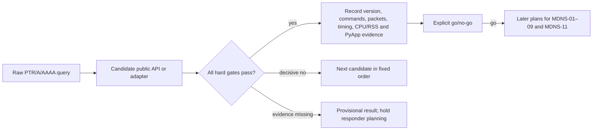

> **2026-09-23 amendment:** The user approved complete-fleet discovery independent of packet grouping. See [03-PACKET-GROUPING-AMENDMENT.md](03-PACKET-GROUPING-AMENDMENT.md). Earlier packet-count requirements and zeroconf rejection on aggregation alone are superseded. Historical observations and reviews below remain unchanged; they do not establish compliance with the revised contract. Do not resume the old execution steps or change the local/CI harness under this amendment.

# Phase 3: mDNS Responder - Research

**Researched:** 2026-09-22
**Domain:** asyncio mDNS responder selection, DNS-SD interoperability and PyApp packaging
**Confidence:** HIGH for repository integration and the spike contract; MEDIUM for candidate suitability pending execution evidence

<user_constraints>
## User Constraints (from CONTEXT.md)

### Locked Decisions

- **D-01:** Keep device advertisement settings in existing factories and server enablement in `EmulatedLifxServer`, preserving existing calls.
- **D-02:** Server argument: `mdns_enabled=False`. Factory arguments: `mdns_enabled=True` and `mdns_address=None`. Device advertisement settings apply when server mDNS is enabled; `None` uses the spec's concrete bind-address fallback.
- **D-03:** Validate as early as possible. Factories reject invalid addresses, wrong families and Thread opt-out immediately. Server startup checks bind-dependent settings; adding a device checks them before registration.
- **D-04:** Device mDNS settings are fixed at creation, like connectivity. Changing the address or WiFi opt-out requires removing and recreating the device.
- **D-05:** Expose read-only `mdns_status` with `disabled`, `stopped`, `running` and `failed` states, plus `mdns_error`; log failures. No status callback was selected.
- **D-06:** Provide explicit `await server.retry_mdns()` to recover failed mDNS on a functioning WiFi-only server without interrupting LIFX traffic. Automatic retries were not selected.
- **D-07:** When enabled mDNS has failed, reject Thread device additions before changing fleet membership, explaining that mDNS must recover first. Intentionally disabled mDNS remains supported.
- **D-08:** Apply the fleet-dependent failure policy to runtime failure too: WiFi-only continues serving LIFX with failed mDNS status; Thread-only and mixed fleets shut down cleanly and retain the failure details.
- **D-09:** Evaluate in order: current `python-zeroconf`; extending or augmenting existing `lifx-async` mDNS; an entirely new responder if neither existing implementation is suitable. Stop investigating a candidate once decisive evidence rules it out.
- **D-10:** Prefer `python-zeroconf` when candidates meet the locked requirements, unless evidence demonstrates a material advantage for an alternative. Use public APIs and a small adapter; dependence on private internals, monkey-patching or a maintained fork favours the fallback candidates.
- **D-11:** For `lifx-async` reuse, compare extending that library directly with adapting relevant code into the emulator. Recommend based on coupling, maintenance and compatibility; neither location is preselected.
- **D-12:** Missing required platform or packaging evidence leaves the choice provisional and holds responder implementation. Record the missing evidence and how to obtain it; confirm go/no-go when required checks run. Do not plan the remaining ten requirements in detail before that decision.
- **D-13:** Benchmark mixed fleets of 1, 10 and 100 devices. Prioritise time for `lifx-async` to discover the complete fleet, recording CPU and memory costs. These are benchmark sizes, not supported fleet limits.
- **D-14:** Share an initial four-hour active-work budget across all candidates; record CI queue time separately. An additional four hours is possible only when initial findings show worthwhile implementation depth, performance or feature completeness within Phase 3 scope. At the limit, record findings and unresolved evidence before proceeding.
- **D-15:** Justify any extension with concrete evidence, documentation links and exact line references. For unnumbered documentation pages, provide version-pinned documentation source links and line numbers. The potential availability of extra time alone does not justify using it.
- **D-16:** Only within a warranted extension, and if time remains after required evidence, test separate-machine feasibility: `lifx-async` on the Mac and `lifx-emulator` in a guest on development Proxmox VE host `devproxmox.lot209.xyz`, on the same multicast-capable network.
- **D-17:** The user reports no usable existing guests. Define and build a small Linux VM with its own kernel/network stack; define resources and network configuration before provisioning. **VM definition, provisioning and cross-machine testing must not occur in the initial four hours.**
- **D-18:** The optional experiment must cover discovery, state queries and light control through advertised endpoints. It is not grounds to extend the spike automatically and does not replace required protocol, coexistence or packaging evidence.

### the agent's Discretion

No explicit discretionary decisions were delegated. Routine internal implementation details remain for research and planning within these decisions; the responder choice remains evidence-gated.

### Deferred Ideas (OUT OF SCOPE)

No additional future-phase capability was adopted. Cross-machine testing remains optional extension-only spike work; full sibling-suite migration stays in Phase 6.
</user_constraints>

## Summary

Plan one bounded MDNS-10 spike, then stop. Current `python-zeroconf` exposes public asyncio construction, registration, update, interface and close APIs, and its source recognises legacy-unicast queries. Its response builder collects records across services into one outgoing answer, so the locked one-complete-packet-per-device behaviour is a material live-test risk rather than a settled compatibility result. [VERIFIED: https://github.com/python-zeroconf/python-zeroconf/blob/0.151.3/src/zeroconf/asyncio.py#L107-L248] [VERIFIED: https://github.com/python-zeroconf/python-zeroconf/blob/0.151.3/src/zeroconf/_handlers/query_handler.py#L200-L284] [VERIFIED: https://github.com/python-zeroconf/python-zeroconf/blob/0.151.3/src/zeroconf/_handlers/answers.py#L82-L110]

The sibling `lifx-async` implementation is a useful acceptance oracle and source-reuse candidate, but the opened modules contain query construction, response parsing, record accumulation and an ephemeral-port client transport rather than a responder encoder/listener. Direct extension and adaptation therefore both require new responder work and must be compared only if zeroconf is ruled out. [VERIFIED: ../lifx-async/src/lifx/network/discovery/mdns/__init__.py:1-42] [VERIFIED: ../lifx-async/src/lifx/network/discovery/mdns/dns.py:1-485] [VERIFIED: ../lifx-async/src/lifx/network/discovery/mdns/transport.py:1-92]

**Primary recommendation:** Plan the four-hour MDNS-10 spike around hard evidence gates in the fixed candidate order; do not select a candidate or plan MDNS-01–09/11 implementation until protocol, daemon coexistence, no-packet-thread, platform and Intel macOS PyApp evidence is complete.

## Architectural Responsibility Map

| Capability | Primary Tier | Secondary Tier | Rationale |
|---|---|---|---|
| Candidate harness and evidence ledger | Test/research tooling | Release CI | Produces the go/no-go evidence without changing production behaviour. |
| mDNS socket and reply lifecycle | Core backend | OS networking | The core server owns endpoints, tasks, startup and shutdown. [VERIFIED: packages/lifx-emulator-core/src/lifx_emulator/server.py:154-190] |
| Discovery completeness | Sibling client | Core responder | `lifx-async` is the consumer oracle and accumulates records across packets. [VERIFIED: ../lifx-async/src/lifx/network/discovery/mdns/discovery.py:707-844] |
| Intel macOS packaging | Release CI | PyApp/runtime installer | The release workflow has a distinct Intel macOS target and pins its build inputs. [VERIFIED: .github/workflows/release-binaries.yml:7-9] [VERIFIED: .github/workflows/release-binaries.yml:23-83] |
| Optional cross-machine proof | External infrastructure | Client/core | D-16–D-18 reserve this for an evidence-justified extension. |

<phase_requirements>
## Phase Requirements

| ID | Description | Research support |
|---|---|---|
| MDNS-01 | Opt-in IPv4 multicast reception beside the host daemon | Future hard gate: socket reuse, membership and daemon coexistence; detailed implementation deferred. |
| MDNS-02 | Correct legacy-unicast replies | Spike gate from RFC 6762 and raw datagram assertions; implementation deferred. |
| MDNS-03 | One complete reply packet per device | Highest-risk candidate discriminator; inspect each datagram at 0/1/many devices. |
| MDNS-04 | Exact `id`, `p`, `fw`, `tm` TXT metadata | Future record-content gate; implementation deferred. |
| MDNS-05 | AAAA-only Thread and A-only WiFi | Spike mixed-family compatibility gate; implementation deferred. |
| MDNS-06 | Explicit usable advertised addresses | Future validation gate; implementation deferred. |
| MDNS-07 | Direct A/AAAA follow-up queries | Spike responder-capability gate; implementation deferred. |
| MDNS-08 | Live membership with multiple listeners | Future integration gate; existing manager has single callback slots. [VERIFIED: packages/lifx-emulator-core/src/lifx_emulator/devices/manager.py:140-156] |
| MDNS-09 | Owned lifecycle and fleet-dependent failure | Future lifecycle gate using existing atomic startup/rollback patterns; implementation deferred. [VERIFIED: packages/lifx-emulator-core/src/lifx_emulator/server.py:869-1064] |
| MDNS-10 | Evidence-led implementation selection | **Plan now:** execute the bounded spike and record explicit go/no-go or provisional outcome. |
| MDNS-11 | Focused datagram, multicast and client tests | Spike evidence criterion; durable implementation tests are planned only after go/no-go. |
</phase_requirements>

## Project Constraints (from AGENTS.md)

- Use Australian English, the latest version when adding dependencies, and address discovered problems or failing tests.
- Preserve unrelated unstaged work. This research owns only this file; the existing planning edits belong to the orchestrator.
- Use `uv` exclusively for Python dependency management and execution; keep imports at the top.
- Commits require `git commit -s` and the configured GPG key. The orchestrator explicitly owns the combined artefact commit, so this researcher must not commit.
- Repository checks use Ruff (line length 88, complexity 10), Pyright standard and function-scoped pytest asyncio loops. [VERIFIED: pyproject.toml:26-75]
- `workflow.nyquist_validation` is `false`, so this research deliberately omits Validation Architecture. [VERIFIED: .planning/config.json:15-31]

## Standard Stack

| Candidate/order | Observed version | Role | Planning direction |
|---|---:|---|---|
| `python-zeroconf` (1) | 0.151.3, released 2026-08-30 | Public asyncio mDNS/DNS-SD implementation | Test first; prefer only if every hard gate passes through public APIs and a small adapter. [VERIFIED: https://pypi.org/project/zeroconf/] |
| sibling `lifx-async` (2) | 7.3.0 | Discovery oracle and possible code/library reuse | Compare direct extension with adaptation only after decisive zeroconf evidence. [VERIFIED: ../lifx-async/pyproject.toml:1-20] |
| standard library/new responder (3) | Python 3.10–3.14 | Final fallback | Scope the minimum responder only if both earlier candidates fail. [VERIFIED: .planning/phases/03-mdns-responder/03-SPEC.md:151-163] |
| PyApp release path | project pin 0.26.0 / Python 3.12 | Intel macOS packaging proof | Test the actual pinned workflow; upstream/latest migration is a separate decision. [VERIFIED: .github/workflows/release-binaries.yml:7-9] |

No project dependency installation is part of research. Spike execution should use an isolated `uv` invocation and record the exact resolved candidate version; adding and locking a production dependency happens only after go/no-go.

## Package Legitimacy Audit

| Package | Registry/source evidence | Heuristic verdict | Disposition |
|---|---|---|---|
| `zeroconf` | Official PyPI metadata links the project to `python-zeroconf/python-zeroconf`; current release is 0.151.3. [VERIFIED: https://pypi.org/project/zeroconf/] | `SUS`: the local legitimacy seam reported “too-new”, unknown downloads and no repository; those metadata signals conflict with the opened official metadata and do not establish package unsuitability. | Authorised spike candidate only; no install-selection conclusion. |

Packages removed as `SLOP`: none. The heuristic result is recorded as a limitation and does not create an approval checkpoint; suitability remains governed by the spike's live evidence.

## Architecture Patterns



Use a criterion-by-criterion evidence ledger. Each result must say demonstrated, failed, simulated or untested; include exact versions, elapsed active time, CI queue time, commands, packet captures/assertions and source/document line links. A score cannot override a failed hard gate.

Stop a candidate as soon as decisive evidence requires private internals, monkey-patching, a maintained fork, violates per-device packet boundaries, or cannot meet a locked platform/package gate. Source inspection may identify the next live check, but it cannot by itself select the implementation.

## MDNS-10 Spike Contract

1. **Start the four-hour active-work clock and ledger.** Record environment, exact versions and exclusions. CI queue time is separate. Do not edit production responder code.
2. **Evaluate current zeroconf first.** Through public APIs only, inject legacy-unicast PTR and direct A/AAAA queries. Assert destination, query ID, questions, cache-flush bits, TTL, exact record sets and exactly one complete datagram per eligible device. Run 1, 10 and 100-device discovery through `lifx-async`, recording complete-fleet time, CPU, peak RSS, datagram count/size and thread inventory.
3. **Prove system boundaries.** Exercise explicit IPv4 interface selection beside the active host daemon, repeated open/close, Ubuntu/macOS actual multicast, identified Windows socket simulation, and Intel macOS PyApp build plus first-run dependency installation using the release workflow. Missing required evidence means provisional, not pass.
4. **Only after decisive zeroconf failure, evaluate lifx-async reuse.** Compare the smallest direct-library extension with the smallest adapted-code implementation for coupling, maintenance, supported Python/platforms and the same protocol gates. The source currently offers no responder encoder, so record the required delta explicitly.
5. **Only after both fail, assess a new responder.** Bound it to the minimum listener, parser/dispatcher and response encoder needed by the locked criteria; do not construct production code during the spike.
6. **At four active hours, stop and decide.** Record go/no-go or provisional plus missing evidence. Request up to four further active hours only with D-15 evidence. VM definition, provisioning and Mac-to-guest discovery/state/control may occur only inside that justified extension after required evidence.

For the size-one benchmark, run one WiFi and one Thread case separately; use deterministic mixed fleets for 10 and 100. This preserves both address-family checks without treating benchmark sizes as support limits.

## Don't Hand-Roll

| Problem | Do not build during MDNS-10 | Use instead |
|---|---|---|
| Candidate DNS correctness | Production responder implementation | Raw datagram assertions plus RFC 6762/6763 criteria. |
| Client acceptance | A substitute discovery parser | Sibling `lifx-async` as the end-to-end oracle. |
| Async task ownership | A second task registry | Existing `BackgroundTaskTracker` pattern after go/no-go. [VERIFIED: packages/lifx-emulator-core/src/lifx_emulator/background_tasks.py:13-173] |
| Cross-machine environment | An initial-timebox VM | D-17 extension-only VM after resources/network are defined. |

## Common Pitfalls

- **Selecting from API shape:** `AsyncZeroconf` and `ServiceInfo` existing does not prove per-device packet boundaries, daemon coexistence, or Intel PyApp operation. Require live evidence. [VERIFIED: https://python-zeroconf.readthedocs.io/en/latest/api.html]
- **Treating absent wheels as incompatibility:** PyPI lists no macOS x86_64 wheel for 0.151.3, but absence is not proof of failure; run the actual PyApp first-run path. [VERIFIED: https://pypi.org/project/zeroconf/]
- **Aggregating evidence:** A client discovering all devices does not prove one complete datagram per device; retain packet-level assertions.
- **Spending the extension early:** source curiosity, available time or an optional VM does not satisfy D-15.
- **Planning ahead:** candidate findings are evaluation criteria only; D-12 forbids detailed MDNS-01–09/11 implementation plans before go/no-go.

## Code Example

Public lifecycle shape to probe, not a production adapter:

```python
# Source: python-zeroconf 0.151.3 public asyncio API
azc = AsyncZeroconf(interfaces=[interface], ip_version=IPVersion.V4Only)
await azc.async_register_service(service_info)
await azc.async_unregister_service(service_info)
await azc.async_close()
```

`ServiceInfo` publicly accepts type, name, port, properties, server, TTLs and addresses; the spike still must inspect emitted packets rather than infer wire shape from these inputs. [VERIFIED: https://github.com/python-zeroconf/python-zeroconf/blob/0.151.3/src/zeroconf/_services/info.py#L178-L235]

## Environment Availability

| Dependency | Available observation | Planning consequence |
|---|---|---|
| `uv` | 0.12.7 | Use for isolated spike execution; do not install during planning. |
| Local Python | 3.14.7 on arm64 macOS | Useful local case, but cannot prove Intel macOS. |
| Rust/Cargo | 1.97 | PyApp build tooling is present locally; Intel proof still belongs on the Intel runner. |
| Intel macOS runner | Defined as `macos-15-intel` in release workflow. [VERIFIED: .github/workflows/release-binaries.yml:23-43] | Queue/build/first-run evidence is required; queue time is outside active-work time. |
| Windows | Release build target exists, but MDNS-11 calls for identified socket simulation. [VERIFIED: .github/workflows/release-binaries.yml:23-43] | Do not report a build target as socket-behaviour evidence. |
| Proxmox guest | User reports none usable (D-17). | No VM work in the initial four hours. |

## Security Domain

| ASVS category | Applies | Spike control |
|---|---|---|
| V2 Authentication | No | mDNS discovery has no application authentication surface. |
| V3 Session Management | No | No sessions. |
| V4 Access Control | No | No privileged operation is exposed by the spike. |
| V5 Input Validation | Yes | Fuzz/truncate DNS questions, reject malformed names/records safely, and bound packet/record work. |
| V6 Cryptography | No | No cryptographic protocol is introduced. |

Treat malformed datagrams and packet floods as availability threats, multicast replies as possible amplification, and interface/address choice as exposure boundaries. The spike should verify bounded parsing/work, legacy replies only to the query source, explicit interface selection, TTL at most 10 and absence of secrets in TXT. RFC 6762 requires legacy-unicast ID/question echo, clear cache-flush bits and TTL no greater than 10 seconds. [VERIFIED: https://datatracker.ietf.org/doc/html/rfc6762#section-6.7]

## Open Questions for Spike Execution

1. Can zeroconf public APIs emit exactly one complete reply packet per device without private hooks?
2. Does explicit-interface operation coexist with the host daemon on every required platform while keeping the packet path thread-free?
3. Does the actual Intel macOS PyApp build and first run install and load the selected dependency successfully?
4. If zeroconf fails, is a direct lifx-async extension or adapted source smaller and safer under the same gates?

These are execution checks, not blockers to planning MDNS-10 and not permission to plan the remaining requirements.

## Assumptions Log

| # | Claim | Risk if wrong |
|---|---|---|
| A1 | Running separate size-one WiFi and Thread cases is the clearest interpretation of D-13's one-device mixed benchmark. | Planner may choose a different documented composition; requirement coverage is unchanged. |

## Sources

### Primary

- [python-zeroconf 0.151.3 public asyncio API](https://github.com/python-zeroconf/python-zeroconf/blob/0.151.3/src/zeroconf/asyncio.py#L107-L248) and [response construction](https://github.com/python-zeroconf/python-zeroconf/blob/0.151.3/src/zeroconf/_handlers/answers.py#L82-L110).
- [Official zeroconf API documentation](https://python-zeroconf.readthedocs.io/en/latest/api.html) and [PyPI release metadata](https://pypi.org/project/zeroconf/).
- [RFC 6762 legacy-unicast rules](https://datatracker.ietf.org/doc/html/rfc6762#section-6.7), [socket coexistence](https://datatracker.ietf.org/doc/html/rfc6762#section-15.1) and [RFC 6763 DNS-SD](https://datatracker.ietf.org/doc/html/rfc6763).
- [PyApp project configuration](https://ofek.dev/pyapp/latest/config/project/), [distribution configuration](https://ofek.dev/pyapp/latest/config/distribution/) and [build guidance](https://ofek.dev/pyapp/latest/build/).
- Repository files cited inline, including the sibling lifx-async source.

## Metadata

**Confidence breakdown:** Standard stack MEDIUM until live compatibility evidence; repository architecture HIGH from opened source; pitfalls HIGH where grounded in source/RFC and MEDIUM for platform outcomes pending execution.

**Research date:** 2026-09-22  
**Valid until:** 2026-10-22; re-check candidate and PyApp releases when executing the spike.
