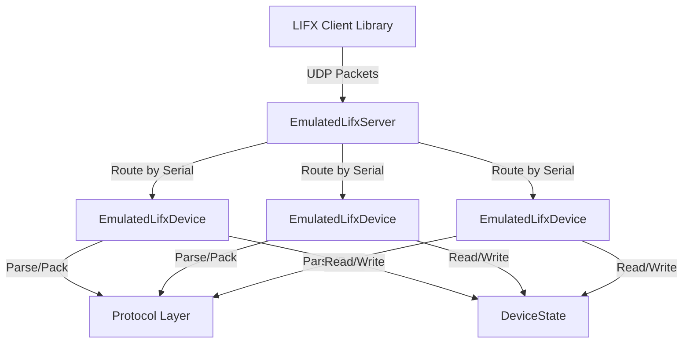
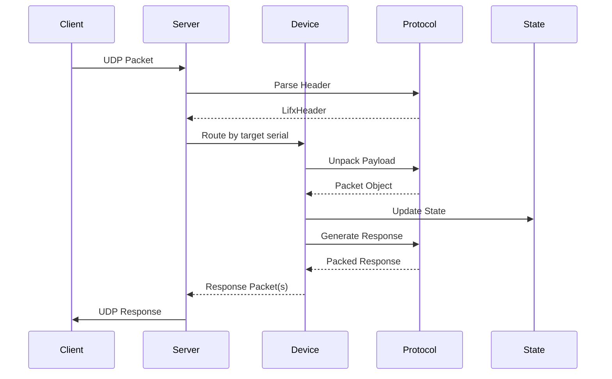

# Architecture Overview

The LIFX Emulator is built with a layered architecture that mirrors real LIFX devices.

## High-Level Architecture



## Core Components

### 1. Server Layer (`EmulatedLifxServer`)

The server layer handles:

- UDP socket management
- Packet reception and sending
- Device routing by serial (encoded in target field)
- Broadcast packet distribution

**Key Responsibilities:**
- Listen on configured IP and port
- Parse packet headers to determine routing
- Forward packets to appropriate devices
- Send responses back to clients

### 2. Device Layer (`EmulatedLifxDevice`)

Each device instance represents a virtual LIFX device:

- Maintains device state
- Processes incoming packets
- Generates response packets
- Handles device-specific logic

**Key Responsibilities:**
- Process packet type routing
- Update state based on commands
- Generate appropriate responses
- Implement device capabilities

### 3. Protocol Layer

The protocol layer implements LIFX LAN protocol:

- Binary packet serialization/deserialization
- Header parsing and generation
- Packet type definitions
- Type conversions

**Components:**
- `LifxHeader` - 36-byte header structure
- Packet classes - 44+ packet type definitions
- `Serializer` - Binary packing/unpacking
- Protocol types - `LightHsbk`, `TileStateDevice`, etc.

### 4. State Layer (`DeviceState`)

Device state is stored in a dataclass:

- Device identity (serial, label, product)
- Capability flags (color, infrared, multizone, etc.)
- Light state (power, color, zones, tiles)
- Firmware version
- Network configuration

## Packet Flow



### Detailed Flow

1. **Reception**
   - Client sends UDP packet to server
   - Server receives bytes on socket

2. **Header Parsing**
   - Extract 36-byte header
   - Parse: target (serial + padding), packet type, flags
   - Determine if broadcast or targeted

3. **Device Routing**
   - If broadcast (tagged=True or target=000000000000): forward to all devices
   - If targeted: find device by serial (encoded in target field)
   - If not found: ignore packet

4. **Packet Processing**
   - Device unpacks payload using packet class
   - Determines packet type (e.g., `Light.SetColor`)
   - Routes to specific handler method

5. **State Update**
   - Handler reads current state
   - Applies command logic
   - Updates state fields

6. **Response Generation**
   - If `res_required=True`: generate state response
   - If `ack_required=True`: generate acknowledgment
   - Create response header with sequence number

7. **Response Sending**
   - Pack response packets to bytes
   - Send back to client via UDP

## Layer Details

### Server Layer

```python
class EmulatedLifxServer:
    """UDP server that routes packets to devices."""

    def __init__(self, devices, device_manager, bind_address="127.0.0.1", port=56700):
        self._device_manager = device_manager  # Owns the device repository
        self.bind_address = bind_address
        self.port = port

    async def start(self):
        """Start UDP server."""
        pass

    async def handle_packet(self, data, addr):
        """Route incoming packet to device(s)."""
        # Parse header
        # Find target device(s)
        # Process and send responses
        pass
```

### Device Layer

```python
class EmulatedLifxDevice:
    """Virtual LIFX device with stateful behavior."""

    def __init__(self, device_state: DeviceState, storage=None, scenario_manager=None):
        self.state = device_state
        self.storage = storage
        self.scenario_manager = scenario_manager  # Testing scenarios
        self.handlers = create_default_registry()

    def process_packet(self, header, packet):
        """Process incoming packet and generate responses."""
        # Handle acknowledgments
        # Route to the handler registered for header.pkt_type
        # Return a list of (header, packet) response tuples
        pass
```

### Protocol Layer

```python
@dataclass
class LifxHeader:
    """36-byte LIFX packet header."""

    size: int = 0
    protocol: int = 1024
    source: int = 0                 # 4-byte identifier
    target: bytes = b"\x00" * 8     # 6-byte serial + 2 null bytes
    tagged: bool = False
    ack_required: bool = False
    res_required: bool = False
    sequence: int = 0               # 1-byte sequence number
    pkt_type: int = 0               # Packet type number
    # ... more fields

    def pack(self) -> bytes:
        """Pack header to 36 bytes."""
        pass

    @classmethod
    def unpack(cls, data: bytes):
        """Parse 36 bytes to header."""
        pass
```

### State Layer

```python
@dataclass
class DeviceState:
    """Device state composed from focused sub-states."""

    # Always present
    core: CoreDeviceState  # serial, label, power_level, color, product, ...
    network: NetworkState
    location: LocationState
    group: GroupState
    waveform: WaveformState

    # Present only when the device has the capability
    infrared: InfraredState | None = None
    hev: HevState | None = None
    multizone: MultiZoneState | None = None  # zone_count, zone_colors
    matrix: MatrixState | None = None  # tile_count, tile_devices

    # Capabilities
    has_color: bool = True
    has_infrared: bool = False
    has_multizone: bool = False
    has_matrix: bool = False
    has_hev: bool = False

    # ... more fields
```

## Capability Flags

Devices advertise capabilities through boolean flags:

| Flag | Capability | Example Products |
|------|------------|------------------|
| `has_color` | Full RGB color | LIFX A19, LIFX Beam |
| `has_infrared` | IR brightness | LIFX A19 Night Vision |
| `has_multizone` | Linear zones | LIFX Z, LIFX Beam |
| `has_extended_multizone` | >16 zones | LIFX Beam |
| `has_matrix` | 2D zone grid | LIFX Tile, LIFX Candle |
| `has_hev` | HEV cleaning | LIFX Clean |

## Packet Types

The emulator implements 44+ packet types across multiple domains:

### Device Domain (2-59)

- `Device.GetService` (2) / `Device.StateService` (3)
- `Device.GetVersion` (32) / `Device.StateVersion` (33)
- `Device.GetLabel` (23) / `Device.StateLabel` (25)
- `Device.SetLabel` (24)
- `Device.GetPower` (20) / `Device.StatePower` (22)
- `Device.SetPower` (21)

### Light Domain (101-149)

- `Light.GetColor` (101) / `Light.StateColor` (107)
- `Light.SetColor` (102)
- `Light.SetWaveform` (103)
- `Light.GetInfrared` (120) / `Light.StateInfrared` (121)
- `Light.SetInfrared` (122)

### MultiZone Domain (501-512)

- `MultiZone.GetColorZones` (502) / `MultiZone.StateZone` (503)
- `MultiZone.StateMultiZone` (506)
- `MultiZone.SetColorZones` (501)
- `MultiZone.GetEffect` (507) / `MultiZone.StateEffect` (509)
- `MultiZone.SetEffect` (508)
- `MultiZone.ExtendedSetColorZones` (510)
- `MultiZone.ExtendedGetColorZones` (511) / `MultiZone.ExtendedStateMultiZone` (512)

### Tile Domain (701-720)

- `Tile.GetDeviceChain` (701) / `Tile.StateDeviceChain` (702)
- `Tile.SetUserPosition` (703)
- `Tile.Get64` (707) / `Tile.State64` (711)
- `Tile.Set64` (715)
- `Tile.CopyFrameBuffer` (716)
- `Tile.GetEffect` (718) / `Tile.StateEffect` (720)
- `Tile.SetEffect` (719)

See [Protocol Layer](protocol.md) for complete packet documentation.

## Design Patterns

### Factory Pattern

Factory functions encapsulate device creation:

```python
def create_color_light(serial=None, storage=None, **options):
    """Create a LIFX Color light with sensible defaults."""
    return create_device(91, serial=serial, storage=storage, **options)
```

### Strategy Pattern

Packet handlers implement strategy pattern: one stateless handler class per
packet type, looked up in a `HandlerRegistry` by `PKT_TYPE`:

```python
def _handle_packet_type(self, header, packet):
    handler = self.handlers.get_handler(header.pkt_type)
    if handler:
        return handler.handle(self.state, packet, header.res_required)
    return []
```

### State Pattern

Device state changes based on received commands:

```python
class SetColorHandler(PacketHandler):
    PKT_TYPE = Light.SetColor.PKT_TYPE

    def handle(self, device_state, packet, res_required):
        if packet:
            device_state.color = packet.color
        if res_required:
            return [Light.StateColor(...)]
        return []
```

## Concurrency Model

The emulator uses Python's asyncio:

- **Single-threaded**: All operations run in the event loop
- **Non-blocking**: Uses async/await for I/O
- **Datagram protocol**: UDP doesn't maintain connections
- **Stateful devices**: Each device maintains independent state

```python
from lifx_emulator import EmulatedLifxServer
from lifx_emulator.devices import DeviceManager
from lifx_emulator.repositories import DeviceRepository

device_manager = DeviceManager(DeviceRepository())
async with EmulatedLifxServer(devices, device_manager, "127.0.0.1", 56700) as server:
    # Server runs in background tasks
    # Your test code runs concurrently
    await asyncio.sleep(1)
```

## Testing Architecture

The emulator supports advanced testing scenarios:

```python
from lifx_emulator.scenarios import ScenarioConfig

server.scenario_manager.set_device_scenario(
    "d073d5000001",
    ScenarioConfig(
        drop_packets={101: 1.0},  # Drop all GetColor packets
        response_delays={102: 0.5},  # Delay SetColor by 500ms
        malformed_packets=[107],  # Truncate StateColor
        invalid_field_values=[22],  # Send invalid StatePower
        partial_responses=[506],  # Incomplete multizone response
    ),
)
server.invalidate_all_scenario_caches()
```

## Next Steps

- [Packet Flow](packet-flow.md) - Detailed packet processing
- [Protocol Layer](protocol.md) - Protocol implementation details
- [Device State](device-state.md) - State management
- [Server API](../library/server.md) - Server documentation
