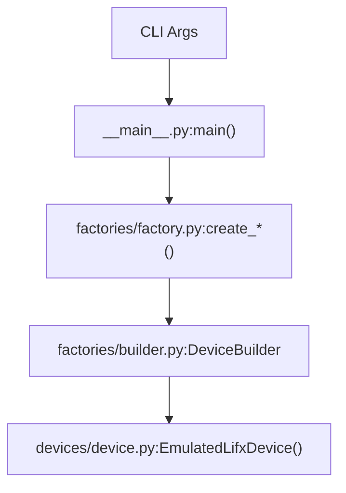
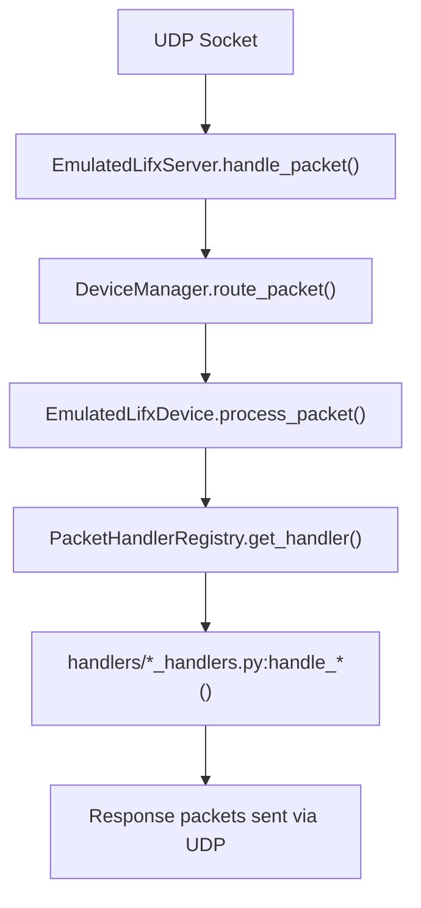
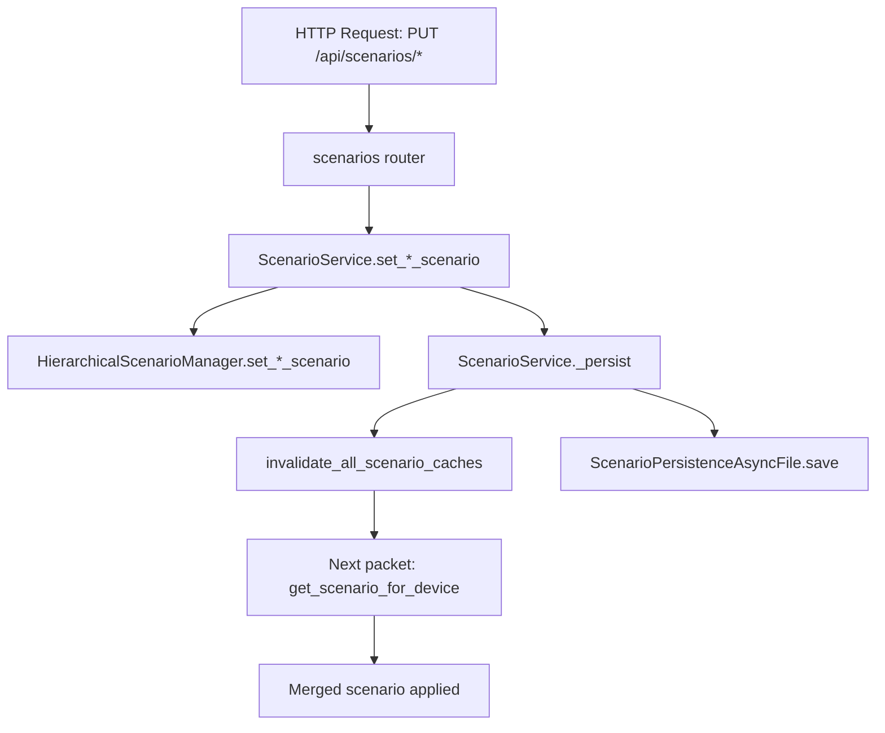
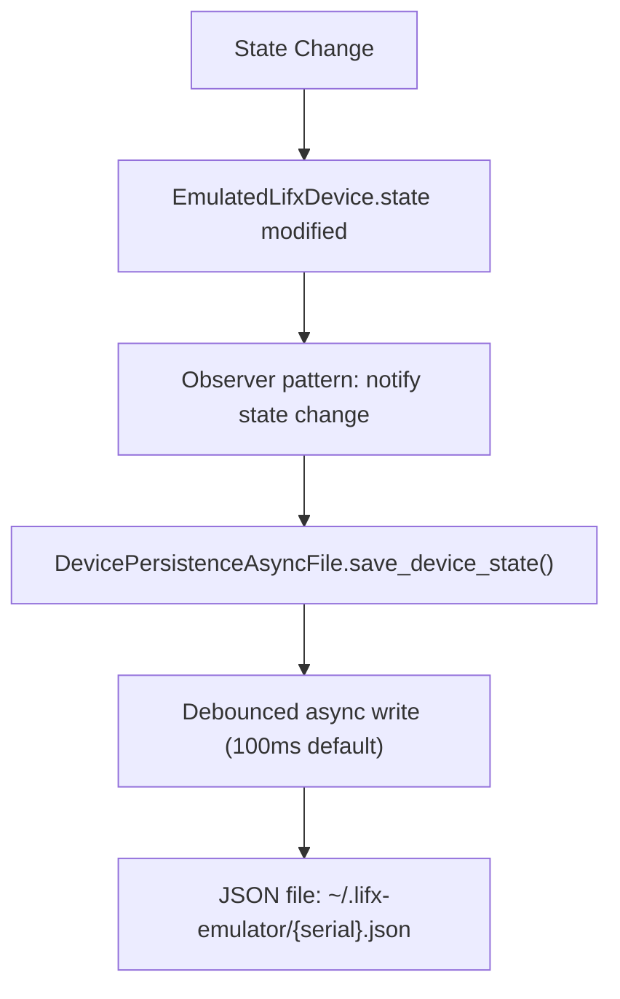

# Code Navigation Guide

> Developer-focused guide to navigating the lifx-emulator codebase

## Quick Stats

- **Core Library**: 13,654 lines of Python across 41 files
- **Standalone App**: 1,672 lines of Python across modules
- **Test Coverage**: 92% (953 test cases)
- **Documentation**: 41 markdown files

## Package Structure

```
lifx-emulator/
├── packages/
│   ├── lifx-emulator-core/          # Library package (13.6k LOC)
│   │   └── src/lifx_emulator/
│   │       ├── devices/             # Device lifecycle and state (10 files)
│   │       ├── scenarios/           # Test scenario management (3 files)
│   │       ├── protocol/            # LIFX binary protocol (7 files)
│   │       ├── handlers/            # Packet type handlers (5 files)
│   │       ├── products/            # Product registry (4 files)
│   │       ├── factories/           # Device creation (6 files)
│   │       ├── repositories/        # Storage abstraction (3 files)
│   │       └── server.py            # UDP server
│   │
│   └── lifx-emulator/               # Standalone package (1.6k LOC)
│       └── src/lifx_emulator_app/
│           ├── __main__.py          # CLI entry point
│           └── api/                 # HTTP API module
│               ├── app.py           # FastAPI application
│               ├── models.py        # Pydantic models
│               ├── routers/         # API endpoints
│               └── services/        # Business logic
│
├── docs/                            # MkDocs documentation (41 files)
└── pyproject.toml                   # Workspace config
```

## Core Library (`lifx-emulator-core`)

### Entry Points

**Main exports** (`packages/lifx-emulator-core/src/lifx_emulator/__init__.py`)

```python
from lifx_emulator import (
    EmulatedLifxServer,      # UDP server
    EmulatedLifxDevice,      # Device instance
    create_color_light,      # Factory functions
    create_multizone_light,
    create_tile_device,
)
```

### Layer Architecture

#### 1. Network Layer
**Purpose**: UDP protocol handling

- `server.py` - `EmulatedLifxServer`
  - Responsibilities: Network I/O, packet routing
  - Dependencies: `DeviceManager`, `HierarchicalScenarioManager`
  - Protocol: asyncio DatagramProtocol

#### 2. Domain Layer
**Purpose**: Business logic and device management

**Device Management** (`devices/`)

- `devices/manager.py` - `DeviceManager`
  - Device lifecycle: add, remove, get, count
  - Packet routing: target resolution, broadcast handling
  - Scenario cache invalidation

- `devices/device.py` - `EmulatedLifxDevice`
  - Main entry: `process_packet()` (line ~100)
  - Packet dispatcher: `_handle_packet_type()` (line ~200)
  - State storage: `DeviceState` dataclass

**Scenario Management** (`scenarios/`)

- `scenarios/manager.py` - `HierarchicalScenarioManager`
  - 5-level precedence: device > type > location > group > global
  - Scenario merging and caching
  - Configuration: `ScenarioConfig` dataclass

**Protocol Layer** (`protocol/`)

- `protocol/packets.py` - Auto-generated packet classes
  - 44+ packet types organized by namespace (Device, Light, MultiZone, Tile)
  - Each class: `PKT_TYPE`, `pack()`, `unpack()`
  - Registry: `PACKET_REGISTRY` dict

- `protocol/header.py` - `LifxHeader`
  - 36-byte LIFX packet header
  - Key fields: target, source, sequence, pkt_type, flags

**Handler Registry** (`handlers/`)

- `handlers/registry.py` - `PacketHandlerRegistry`
  - Maps packet types → handler functions
  - Modular handlers by namespace:
    - `device_handlers.py` - Device.* packets (types 2-59)
    - `light_handlers.py` - Light.* packets (types 101-149)
    - `multizone_handlers.py` - MultiZone.* packets (types 501-512)
    - `tile_handlers.py` - Tile.* packets (types 701-720)

#### 3. Repository Layer
**Purpose**: Storage abstraction

**Interfaces** (`repositories/`)

- `repositories/storage_backend.py`
  - `IDeviceRepository` - In-memory device collection
  - `IDeviceStorageBackend` - Device state persistence
  - `IScenarioStorageBackend` - Scenario persistence

**Implementations**

- `repositories/device_repository.py` - In-memory dict storage
- `devices/persistence.py` - Async file persistence with debouncing
- `scenarios/persistence.py` - Atomic scenario file writes

#### 4. State Management
**Purpose**: Device state representation

**State Dataclasses** (`devices/states.py`)

```python
@dataclass
class DeviceState:
    """Complete device state"""
    core: CoreDeviceState        # Serial, power, label, firmware
    color: ColorState | None      # HSBK color for color devices
    infrared: InfraredState | None
    hev: HevState | None
    multizone: MultiZoneState | None
    matrix: MatrixState | None
    relay: RelayState | None
```

**Capability Detection**

- `has_color`, `has_infrared`, `has_multizone`, `has_matrix`, `has_hev`
- `has_relays`, `has_buttons` (for LIFX Switch devices)

### Factory System

**Factory Functions** (`factories/factory.py`)

```python
# Simple factories
create_color_light(serial, storage) -> EmulatedLifxDevice
create_multizone_light(serial, zone_count, extended_multizone, storage)
create_tile_device(serial, tile_count, storage)
create_switch(serial, product_id, storage)

# Universal factory
create_device(product_id, serial, zone_count, tile_count, storage)
```

**Builder Pattern** (`factories/builder.py`)

```python
builder = (
    DeviceBuilder()
    .with_serial("d073d5000001")
    .with_product(27)  # LIFX A19
    .with_color_support()
    .with_infrared_support()
    .build()
)
```

**Configuration Services**

- `factories/serial_generator.py` - Serial number generation
- `factories/firmware_config.py` - Firmware version logic
- `factories/default_config.py` - Default color/power values

### Product Registry

**Registry** (`products/registry.py`)

- **Auto-generated** from LIFX GitHub (DO NOT EDIT)
- 137+ product definitions with capabilities
- Pre-built `ProductInfo` instances

**Specs** (`products/specs.py` + `specs.yml`)

- Product-specific configuration
- Zone counts, tile dimensions, defaults
- Manually maintained for accuracy

**Generator** (`products/generator.py`)

```bash
python -m lifx_emulator.products.generator
# Downloads latest products.json
# Regenerates registry.py
# Updates specs.yml templates
```

### Protocol Components

**Serializer** (`protocol/serializer.py`)

- Low-level binary packing/unpacking
- Handles: byte arrays, enums, nested types, arrays

**Types** (`protocol/protocol_types.py`)

- `LightHsbk` - Color representation
- `TileStateDevice` - Tile configuration
- Effect settings, enums, constants

**Generator** (`protocol/generator.py`)

```bash
python -m lifx_emulator.protocol.generator
# Regenerates packets.py from LIFX YAML spec
```

## Standalone App (`lifx-emulator`)

### CLI Entry Point

**Main** (`packages/lifx-emulator/src/lifx_emulator_app/__main__.py`)

- Command-line argument parsing (cyclopts)
- Device creation from CLI parameters
- Server startup and lifecycle management
- Subcommands: `list-products`

### HTTP API Module

**FastAPI App** (`api/app.py`)

```python
def create_api_app(server: EmulatedLifxServer) -> FastAPI:
    """Creates OpenAPI 3.1.0 compliant FastAPI application"""

def run_api_server(server, host, port):
    """Run uvicorn ASGI server"""
```

**Routers** (`api/routers/`)

- `monitoring.py` - `/api/stats`, `/api/activity`
- `devices.py` - `/api/devices`, `/api/devices/{serial}`
- `scenarios.py` - `/api/scenarios/*` (5 scope levels)

**Models** (`api/models.py`)

- Pydantic request/response validation
- OpenAPI schema generation
- Type-safe API contracts

**Services** (`api/services/`)

- Business logic layer separating API concerns from domain logic
- `device_service.py` - `DeviceService`: device CRUD (list, get, create, delete, clear)
- `scenario_service.py` - `ScenarioService`: scenario get/set/delete across all 5 scope levels (global, device, type, location, group) with automatic cache invalidation and persistence

## Key File Locations

### Configuration

- `pyproject.toml` - Workspace configuration
- `packages/lifx-emulator-core/pyproject.toml` - Library package config
- `packages/lifx-emulator/pyproject.toml` - App package config

### Testing

- `packages/lifx-emulator-core/tests/` - Library tests
- `packages/lifx-emulator/tests/` - App/API tests
- Test count: 953 total

### Documentation

- `docs/` - MkDocs documentation (41 files)
- `CLAUDE.md` - AI assistant guidance
- `README.md` - Project overview

### Auto-Generated (DO NOT EDIT)

- `packages/lifx-emulator-core/src/lifx_emulator/products/registry.py`
- `packages/lifx-emulator-core/src/lifx_emulator/protocol/packets.py`

## Common Code Paths

### Creating a Device


### Processing a Packet


### Scenario Application


### State Persistence


## Development Workflow

### Quick Commands
```bash
# Code quality
ruff check --fix .                # Lint and auto-fix
pyright                          # Type checking
pytest -v                        # Run all tests

# Run emulator
python -m lifx_emulator_app      # CLI mode
lifx-emulator --api              # With HTTP API

# Regenerate code
python -m lifx_emulator.products.generator   # Update registry
python -m lifx_emulator.protocol.generator   # Update packets
```

### Testing Specific Components
```bash
# Test specific module
pytest packages/lifx-emulator-core/tests/test_device.py -v

# Test with coverage
pytest --cov=lifx_emulator --cov-report=html

# Run specific test
pytest packages/lifx-emulator-core/tests/test_device.py::test_process_packet -v
```

## Module Dependencies

### Core Library Dependencies
```
lifx_emulator/
├── server.py → devices.manager, scenarios.manager
├── devices/
│   ├── device.py → states, handlers.registry, scenarios.models
│   ├── manager.py → repositories.device_repository
│   ├── persistence.py → repositories.storage_backend
│   └── states.py → (no internal deps)
├── scenarios/
│   ├── manager.py → models, persistence
│   └── models.py → (pydantic only)
├── protocol/
│   ├── packets.py → header, serializer, protocol_types
│   └── header.py → (struct only)
├── handlers/
│   └── *_handlers.py → protocol.packets, devices.states
├── products/
│   └── registry.py → specs
└── factories/
    └── factory.py → builder, devices.device, products.registry
```

### External Dependencies

- **pydantic**: State validation, API models
- **pyyaml**: Product specs loading
- **fastapi**: HTTP API (app only)
- **uvicorn**: ASGI server (app only)
- **cyclopts**: CLI parsing (app only)
- **rich**: Terminal UI (app only)

## Cross-Reference Index

### By Feature

**Device Creation**

- Entry: `factories/__init__.py`
- Functions: `factories/factory.py`
- Builder: `factories/builder.py`
- Docs: `docs/library/factories.md`

**Packet Processing**

- Entry: `devices/device.py` (`process_packet`)
- Handlers: `handlers/registry.py`
- Protocol: `protocol/packets.py`
- Docs: `docs/architecture/packet-flow.md`

**State Management**

- States: `devices/states.py`
- Persistence: `devices/persistence.py`
- Serialization: `devices/state_serializer.py`
- Docs: `docs/architecture/device-state.md`, `docs/library/storage.md`

**Scenario Management**

- Manager: `scenarios/manager.py`
- Models: `scenarios/models.py`
- Service: `api/services/scenario_service.py`
- API: `api/routers/scenarios.py`
- Docs: `docs/guide/testing-scenarios.md`, `docs/cli/scenario-api.md`

**HTTP API**

- App: `api/app.py`
- Routers: `api/routers/`
- Services: `api/services/device_service.py`, `api/services/scenario_service.py`
- Models: `api/models.py`
- Docs: `docs/cli/web-interface.md`, `docs/cli/device-management-api.md`

### By Layer

**Network Layer**

- `server.py` - UDP server
- Docs: `docs/library/server.md`

**Domain Layer**

- `devices/manager.py` - Device management
- `scenarios/manager.py` - Scenario management
- Docs: `docs/architecture/overview.md`

**Repository Layer**

- `repositories/device_repository.py` - In-memory storage
- `repositories/storage_backend.py` - Interfaces
- Docs: `docs/architecture/overview.md` (Repository Pattern section)

**Persistence Layer**

- `devices/persistence.py` - Device state files
- `scenarios/persistence.py` - Scenario files
- Docs: `docs/library/storage.md`, `docs/cli/storage.md`

## Next Steps

- **New to the codebase?** Start with `docs/getting-started/quickstart.md`
- **Adding features?** Review `docs/architecture/overview.md`
- **Writing tests?** Check `docs/guide/integration-testing.md`
- **Using the API?** See `docs/cli/device-management-api.md`
- **Understanding protocol?** Read `docs/architecture/protocol.md`

## Related Documentation

- [Architecture Overview](../architecture/overview.md) - System design
- [Device Types](../guide/device-types.md) - Supported devices
- [Testing Scenarios](../guide/testing-scenarios.md) - Error simulation
- [CLI Reference](../cli/cli-reference.md) - Command-line options
- [Library Reference](../library/index.md) - Python API
