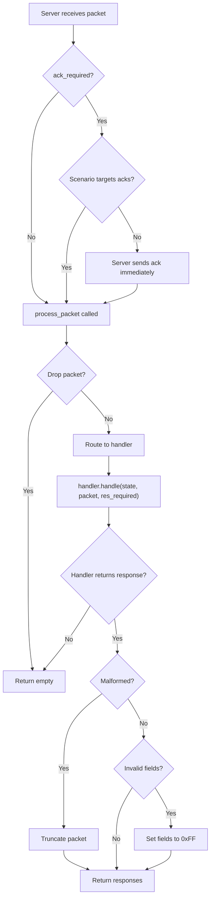

# Device API Reference

> Device state management and emulated device implementation.

The device module provides the core classes for emulating LIFX devices: `DeviceState` holds all stateful information, and `EmulatedLifxDevice` processes incoming LIFX protocol packets and generates appropriate responses.

---

## Table of Contents

### Classes

- [DeviceState](#devicestate)
- [EmulatedLifxDevice](#emulatedlifxdevice)

### Key Concepts

- [Capability Flags](#capability-flags)
- [Testing Scenarios](#testing-scenarios)
- [State Access Patterns](#state-access-patterns)
- [Packet Processing Flow](#packet-processing-flow)

---

## DeviceState

Composed dataclass holding all stateful information for an emulated LIFX device.

`DeviceState` represents the complete state of a virtual LIFX device, including identity (serial, product ID), current settings (color, power, label), capabilities (color, multizone, matrix, etc.), and feature-specific state (zones, tiles, HEV cycle status).

`DeviceState` is not a flat dataclass: it is composed of focused sub-states (`core`, `network`, `location`, `group`, `waveform`, plus optional `infrared`, `hev`, `multizone` and `matrix`). Its constructor takes those sub-state objects, not keyword arguments such as `serial=` or `label=`. See [Device State](../architecture/device-state.md) for the full structure.

!!! tip "Create devices with the factory functions"
    Don't construct `DeviceState` by hand. Use the [factory functions](factories.md) (`create_color_light()`, `create_multizone_light()`, `create_tile_device()`, `create_device()` and friends), which build the correct sub-states and capability flags from the product registry and `specs.yml`, then return an `EmulatedLifxDevice`. The state is available as `device.state`.

```python
from lifx_emulator.factories import create_color_light

device = create_color_light("d073d5000001")
state = device.state
state.label = "Living Room"

print(state.serial)  # d073d5000001
print(state.product)  # 91 (LIFX Color, the default for create_color_light)
print(state.core.label)  # Living Room
```

### Attributes

The attributes below are read and written directly on `DeviceState`; each one is delegated to the sub-state that owns it (for example, `state.label` reads `state.core.label`, and `state.zone_count` reads `state.multizone.zone_count`). Default values shown are those used when the device is created by a factory function.

#### Identity

- **`serial`** (`str`) - 12-character hexadecimal device serial number
- **`mac_address`** (`bytes`) - 6-byte MAC address (derived from serial)
- **`vendor`** (`int` = `1`) - LIFX vendor ID (always 1)
- **`product`** (`int`) - Product ID (e.g., 27 for A19, 32 for Z strip)
- **`version_major`** (`int`) - Firmware major version
- **`version_minor`** (`int`) - Firmware minor version

#### Basic State

- **`port`** (`int` = `56700`) - UDP port for communication
- **`label`** (`str`) - Device label (max 32 bytes)
- **`power_level`** (`int` = `0`) - Power state (0=off, 65535=on)
- **`color`** (`LightHsbk`) - Current HSBK color
- **`uptime_ns`** (`int` = `0`) - Device uptime in nanoseconds
- **`build_timestamp`** (`int`) - Firmware build timestamp (Unix epoch)

#### Capability Flags

- **`has_color`** (`bool` = `True`) - Supports full RGB color
- **`has_infrared`** (`bool` = `False`) - Supports infrared (night vision)
- **`has_multizone`** (`bool` = `False`) - Supports multizone (linear strips)
- **`has_matrix`** (`bool` = `False`) - Supports matrix (2D tiles)
- **`has_chain`** (`bool` = `False`) - Supports multiple tiles
- **`has_hev`** (`bool` = `False`) - Supports HEV (germicidal light)

#### Location & Group

- **`location_id`** (`bytes`) - 16-byte location UUID
- **`location_label`** (`str` = `'Test Location'`) - Location name
- **`location_updated_at`** (`int`) - Location update timestamp (nanoseconds)
- **`group_id`** (`bytes`) - 16-byte group UUID
- **`group_label`** (`str` = `'Test Group'`) - Group name
- **`group_updated_at`** (`int`) - Group update timestamp (nanoseconds)

#### Network

- **`wifi_signal`** (`float` = `-45.0`) - WiFi signal strength in dBm

#### Infrared (Night Vision)

- **`infrared_brightness`** (`int` = `0`) - IR brightness (0-65535)

#### HEV (Germicidal Light)

- **`hev_cycle_duration_s`** (`int` = `7200`) - HEV cycle duration in seconds
- **`hev_cycle_remaining_s`** (`int` = `0`) - Remaining time in current cycle
- **`hev_cycle_last_power`** (`bool` = `False`) - Last power state before cycle
- **`hev_indication`** (`bool` = `True`) - Enable visual indication during cycle
- **`hev_last_result`** (`int` = `0`) - Result of last HEV cycle

#### Multizone (Linear Strips)

- **`zone_count`** (`int` = `0`) - Number of zones (0 if not multizone)
- **`zone_colors`** (`list[LightHsbk]` = `[]`) - Color for each zone

#### Matrix (Tiles)

- **`tile_count`** (`int` = `0`) - Number of tiles in chain
- **`tile_devices`** (`list[dict]` = `[]`) - Per-tile state (position, colors)
- **`tile_width`** (`int` = `8`) - Width of each tile in zones, fixed per product from `specs.yml`
- **`tile_height`** (`int` = `8`) - Height of each tile in zones, fixed per product from `specs.yml`

#### Effects (Waveforms & Animations)

- **`waveform_active`** (`bool` = `False`) - Whether a waveform is running
- **`waveform_type`** (`int` = `0`) - Waveform type (saw, sine, etc.)
- **`waveform_transient`** (`bool` = `False`) - Return to original color after waveform
- **`waveform_color`** (`LightHsbk`) - Target waveform color
- **`waveform_period_ms`** (`int` = `0`) - Waveform period in milliseconds
- **`waveform_cycles`** (`float` = `0`) - Number of cycles (0 = infinite)
- **`waveform_duty_cycle`** (`int` = `0`) - Duty cycle for pulse waveform
- **`waveform_skew_ratio`** (`int` = `0`) - Skew ratio for waveform
- **`multizone_effect_type`** (`int` = `0`) - Multizone effect type (move, etc.)
- **`multizone_effect_speed`** (`int` = `5`) - Multizone effect speed
- **`tile_effect_type`** (`int` = `0`) - Tile effect type
- **`tile_effect_speed`** (`int` = `5`) - Tile effect speed
- **`tile_effect_palette_count`** (`int` = `0`) - Number of colors in effect palette
- **`tile_effect_palette`** (`list[LightHsbk]` = `[]`) - Effect palette colors

### Methods

#### `get_target_bytes() -> bytes`

Get the 8-byte target field for this device (6-byte serial + 2 null bytes).

**Returns:** `bytes` - Target bytes for packet header

**Example:**
```python
from lifx_emulator.factories import create_color_light

device = create_color_light("d073d5000001")
target = device.state.get_target_bytes()
# Returns: b'\xd0s\xd5\x00\x00\x01\x00\x00'
```

---

## EmulatedLifxDevice

Emulated LIFX device that processes protocol packets and manages state.

`EmulatedLifxDevice` is the main class for emulating a LIFX device. It receives LIFX protocol packets via `process_packet()`, updates internal state, and returns appropriate response packets. It supports configurable testing scenarios for error injection, delays, and malformed responses.

### Constructor

#### `EmulatedLifxDevice(device_state, storage=None, handler_registry=None, scenario_manager=None, on_state_changed=None, persist_initial_state=False)`

Create a new emulated LIFX device.

In most cases you should not call this constructor directly: the [factory functions](factories.md) build a fully configured `DeviceState` for a product and wrap it in an `EmulatedLifxDevice` for you, and accept the same `storage` and `scenario_manager` collaborators.

**Parameters:**

- **`device_state`** (`DeviceState`) - Initial device state
- **`storage`** (`DevicePersistenceAsyncFile | None`) - Optional async persistent storage for state
- **`handler_registry`** (`HandlerRegistry | None`) - Optional custom packet handler registry
- **`scenario_manager`** (`HierarchicalScenarioManager | None`) - Optional scenario manager for testing scenarios (see [Testing Scenarios](#testing-scenarios))
- **`on_state_changed`** (`StateChangeCallback | None`) - Optional callback invoked after a state-changing packet
- **`persist_initial_state`** (`bool` = `False`) - Save the initial state as soon as persistence is activated

**Example:**
```python
from lifx_emulator.factories import create_color_light
from lifx_emulator.scenarios import HierarchicalScenarioManager, ScenarioConfig

# Create basic device
device = create_color_light("d073d5000001")
device.state.label = "Living Room"

# Create device with testing scenarios
manager = HierarchicalScenarioManager()
manager.set_device_scenario(
    "d073d5000002",
    ScenarioConfig(
        drop_packets={102: 1.0},  # Drop all SetColor packets (100% drop rate)
        response_delays={2: 0.5},  # Delay GetService responses by 500ms
    ),
)
device = create_color_light("d073d5000002", scenario_manager=manager)
```

### Methods

#### `get_uptime_ns() -> int`

Calculate current uptime in nanoseconds since device creation.

**Returns:** `int` - Uptime in nanoseconds

#### `invalidate_scenario_cache() -> None`

Discard the cached, merged scenario configuration so it is re-resolved from the scenario manager on the next packet. Call this after changing scenarios at runtime (the server's `invalidate_all_scenario_caches()` does this for every device).

#### `process_packet(header: LifxHeader, packet: Any | None, *, scenario: ScenarioConfig | None = None, should_respond: bool | None = None) -> list[tuple[LifxHeader, Any]]`

Process an incoming LIFX protocol packet and generate response packets.

This is the main entry point for packet processing. It:

1. Routes the packet to the appropriate handler based on packet type
2. Applies testing scenarios (delays, drops, malformed responses)
3. Returns a list of response packets (header, payload) tuples

!!! note
    Acknowledgment packets (type 45) are normally sent by the server immediately before calling `process_packet()`. The device only generates acks itself when a scenario targets ack behavior (e.g., delaying, dropping, or corrupting type 45).

**Parameters:**

- **`header`** (`LifxHeader`) - Parsed packet header
- **`packet`** (`Any | None`) - Parsed packet payload (None for header-only packets)
- **`scenario`** (`ScenarioConfig | None`) - Pre-resolved scenario; resolved from the device's scenario manager when omitted
- **`should_respond`** (`bool | None`) - Pre-resolved drop decision; resolved from the scenario when omitted

**Returns:** `list[tuple[LifxHeader, Any]]` - List of response packets to send

**Example:**
```python
from lifx_emulator.factories import create_color_light
from lifx_emulator.protocol.header import LifxHeader
from lifx_emulator.protocol.packets import Light
from lifx_emulator.protocol.protocol_types import LightHsbk

device = create_color_light("d073d5000001")

# Build (or unpack from the wire) an incoming SetColor request
packet = Light.SetColor(
    color=LightHsbk(hue=21845, saturation=65535, brightness=32768, kelvin=3500),
    duration=0,
)
header = LifxHeader(
    source=12345,
    target=device.state.get_target_bytes(),
    res_required=True,
    sequence=1,
    pkt_type=Light.SetColor.PKT_TYPE,
)

# Process and get responses
responses = device.process_packet(header, packet)

# Each response is a (header, packet) tuple ready to pack and send
for resp_header, resp_packet in responses:
    raw_response = resp_header.pack() + resp_packet.pack()
    print(resp_header.pkt_type, len(raw_response))  # 107 88 (Light.State)
```

---

## Capability Flags

Capability flags in `DeviceState` determine which features the device supports and which packet types it can handle.

| Flag | Description | Example Products | Supported Packets |
|------|-------------|------------------|-------------------|
| `has_color` | Full RGB color control | A19 (27), BR30 (43), GU10 (66) | `Light.Get`, `Light.SetColor`, `Light.State` |
| `has_infrared` | Night vision IR capability | A19 Night Vision (29), BR30 NV (44) | `Light.GetInfrared`, `Light.SetInfrared`, `Light.StateInfrared` |
| `has_multizone` | Linear zone control (strips) | LIFX Z (32), Beam (38) | `MultiZone.GetColorZones`, `MultiZone.SetColorZones`, `MultiZone.StateZone`, `MultiZone.StateMultiZone` |
| `has_extended_multizone` | Extended multizone support | Beam (38), LIFX Z (32) | `MultiZone.GetExtendedColorZones`, `MultiZone.SetExtendedColorZones`, `MultiZone.ExtendedStateMultiZone` |
| `has_matrix` | 2D tile/matrix control | Tile (55), Candle (57), Ceiling (176) | `Tile.GetDeviceChain`, `Tile.Get64`, `Tile.Set64`, `Tile.StateDeviceChain`, `Tile.State64` |
| `has_chain` | Supports multiple tiles | Tile (55) | `Tile.StateDeviceChain` may report multiple `tile_devices` |
| `has_hev` | Germicidal UV-C light | LIFX Clean (90) | `Hev.GetCycle`, `Hev.SetCycle`, `Hev.StateCycle` |
| `has_relays` | Relay/switch control | LIFX Switch (70) | `Device.*` only (returns `StateUnhandled` for Light/MultiZone/Tile) |
| `has_buttons` | Physical button configuration | LIFX Switch (70), LIFX Luna (199) | Button-related device packets |

**Notes:**

- Devices without a capability flag will ignore related packets
- Most devices have `has_color=True` (except switches and relays)
- `has_extended_multizone` is independent of zone count — it indicates firmware support for the extended multizone protocol
- Matrix devices store tile data in `tile_devices` list

Capability flags are set by the factory functions from the product registry, so you choose a product rather than setting flags yourself.

**Example:**
```python
from lifx_emulator.factories import create_device

# Create a multizone device (LIFX Z, product 32) with 16 zones
strip = create_device(32, serial="d073d5000002", zone_count=16)
print(strip.state.has_multizone, strip.state.zone_count)  # True 16

# Create a matrix device (LIFX Tile, product 55) with a chain of 5 tiles.
# Tile dimensions are fixed by the product (8x8 for the Tile).
tiles = create_device(55, serial="d073d5000003", tile_count=5)
print(tiles.state.has_matrix, tiles.state.tile_count)  # True 5
print(f"{tiles.state.tile_width}x{tiles.state.tile_height}")  # 8x8
```

---

## Testing Scenarios

Scenarios configure error injection and testing behaviours for emulated devices. Each scenario is a `ScenarioConfig` registered with a `HierarchicalScenarioManager` at device, type, location, group or global scope; pass the manager to the factory function (or `EmulatedLifxDevice`) as `scenario_manager`. This is useful for testing client library error handling, timeouts, and edge cases.

### Available Scenarios

| Scenario | Type | Description | Example |
|----------|------|-------------|---------|
| `drop_packets` | `dict[int, float]` | Packet types to drop with rates (0.0-1.0) | `{102: 1.0, 101: 0.5}` - Always drop SetColor, drop Get 50% |
| `response_delays` | `dict[int, float]` | Delay (seconds) before responding to packet type | `{2: 1.5}` - Delay GetService by 1.5s |
| `malformed_packets` | `list[int]` | Packet types to send truncated/corrupted | `[107]` - Corrupt State packets |
| `invalid_field_values` | `list[int]` | Packet types to send with invalid fields (0xFF) | `[107]` - Invalid State values |
| `partial_responses` | `list[int]` | Multizone/tile packets to send incomplete | `[506]` - Partial zone data |
| `firmware_version` | `tuple[int, int]` | Override firmware version | `(2, 80)` - Report v2.80 |

### Examples

```python
from lifx_emulator.factories import create_color_light, create_multizone_light
from lifx_emulator.scenarios import HierarchicalScenarioManager, ScenarioConfig

manager = HierarchicalScenarioManager()
```

**Simulate network issues:**
```python
manager.set_device_scenario(
    "d073d5000001",
    ScenarioConfig(
        drop_packets={2: 1.0},  # Drop all GetService packets - simulate discovery failure
        response_delays={102: 2.0},  # Delay SetColor by 2 seconds
    ),
)
device = create_color_light("d073d5000001", scenario_manager=manager)
```

**Test error handling:**
```python
manager.set_device_scenario(
    "d073d5000002",
    ScenarioConfig(
        malformed_packets=[107],  # Corrupt Light.State responses
        invalid_field_values=[118],  # Invalid Light.StatePower values
    ),
)
device = create_color_light("d073d5000002", scenario_manager=manager)
```

**Test multizone edge cases:**
```python
manager.set_type_scenario(
    "multizone",
    ScenarioConfig(partial_responses=[506]),  # Send incomplete StateMultiZone packets
)
strip = create_multizone_light("d073d5000003", extended_multizone=False, scenario_manager=manager)
```

**Test firmware compatibility:**
```python
manager.set_global_scenario(
    ScenarioConfig(firmware_version=(2, 77)),  # Report older firmware version
)
device = create_color_light("d073d5000004", scenario_manager=manager)
```

If you change scenarios after devices have processed packets, call `device.invalidate_scenario_cache()` (or `server.invalidate_all_scenario_caches()`) so the new configuration takes effect.

---

## State Access Patterns

### Reading State

Access device state directly through the `state` attribute:

```python
from lifx_emulator.factories import create_multizone_light

device = create_multizone_light("d073d5000002", zone_count=16)

# Check power
if device.state.power_level == 65535:
    print("Device is on")

# Check color
print(f"Hue: {device.state.color.hue}")
print(f"Brightness: {device.state.color.brightness}")

# Check zones (multizone)
if device.state.has_multizone:
    for i, color in enumerate(device.state.zone_colors):
        print(f"Zone {i}: {color}")
```

### Modifying State

Modify state attributes directly; each assignment is routed to the owning sub-state:

```python
from lifx_emulator.factories import create_color_light
from lifx_emulator.protocol.protocol_types import LightHsbk

device = create_color_light("d073d5000001")

# Change color
device.state.color = LightHsbk(hue=21845, saturation=65535, brightness=32768, kelvin=3500)

# Change label
device.state.label = "Kitchen Light"

# Power on
device.state.power_level = 65535
```

State changes made by protocol packets (SetColor, SetPower, SetLabel and so on) are queued for saving automatically when the device has storage. Direct attribute assignments like the ones above are not; queue a save yourself with `await device.storage.save_device_state(device.state)`.

### Persistent Storage Integration

Use `DevicePersistenceAsyncFile` to persist state across restarts. Pass the same storage and serial to a factory function on the next run and the saved state is restored:

```python
import asyncio

from lifx_emulator.devices import DevicePersistenceAsyncFile
from lifx_emulator.factories import create_color_light


async def main():
    storage = DevicePersistenceAsyncFile()  # Uses ~/.lifx-emulator by default
    device = create_color_light("d073d5000001", storage=storage)
    device.state.label = "Kitchen Light"

    # Queue an async save, then flush pending writes before exiting
    await storage.save_device_state(device.state)
    await storage.shutdown()

    # On the next run, state is restored from ~/.lifx-emulator/d073d5000001.json
    restored = create_color_light("d073d5000001", storage=DevicePersistenceAsyncFile())
    print(restored.state.label)  # Kitchen Light


asyncio.run(main())
```

---

## Packet Processing Flow

The packet processing flow in `EmulatedLifxDevice.process_packet()` follows these steps:



**Key Points:**

- Acknowledgments (packet type 45) are sent by the server immediately before `process_packet()` for minimal latency. When a scenario targets ack behavior, the device generates the ack instead so it goes through scenario processing.
- `res_required` is passed to the handler, which decides whether to return a response based on its value
- Handlers are registered by packet type and dispatched via `HandlerRegistry`
- Testing scenarios (malformed, invalid fields) are applied after handler execution, before returning responses
- Multiple response packets may be returned (e.g., multizone queries return multiple `StateMultiZone` packets)

**See Also:**

- [EmulatedLifxServer](server.md) - UDP server that routes packets to devices
- [Protocol Packets](protocol.md) - LIFX protocol packet definitions
- [Factories](factories.md) - Helper functions for creating pre-configured devices
- [Storage](storage.md) - Persistent state storage API

---

## References

**Source:** `packages/lifx-emulator-core/src/lifx_emulator/devices/device.py`, `packages/lifx-emulator-core/src/lifx_emulator/devices/states.py`

**Related Documentation:**

- [Getting Started](../getting-started/quickstart.md) - Quick start guide
- [Device Types](../guide/device-types.md) - Supported device types and capabilities
- [Testing Scenarios](../guide/testing-scenarios.md) - Detailed testing scenario guide
- [Architecture Overview](../architecture/overview.md) - System architecture
